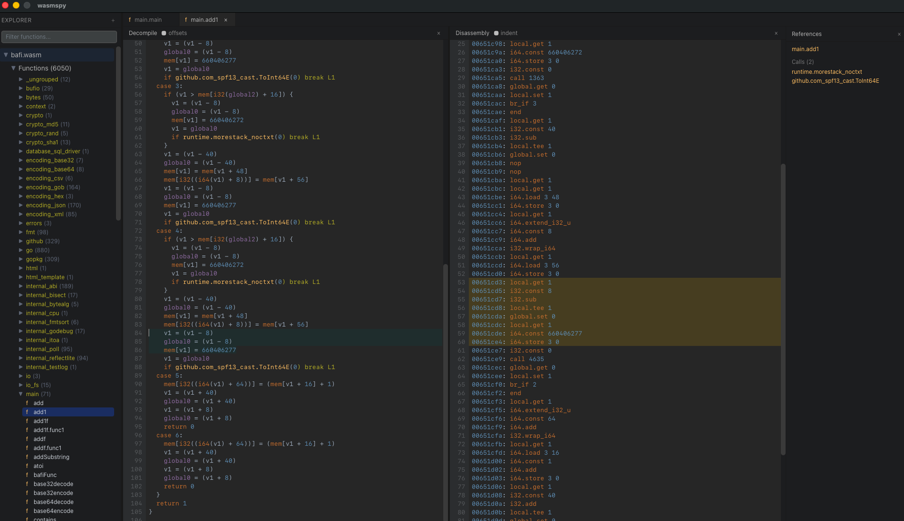

# wasmspy



> **Note:** This project is currently under active development. There are no stable releases at this time.

## Getting Started

### Prerequisites
You need to have **[Wails](https://wails.io/docs/gettingstarted/installation/)** installed to run this project.

### Installation
```bash
git clone https://github.com/0xInception/wasmspy
cd wasmspy
wails dev
```

## References
- [WebAssembly Core Specification (HTML)](https://webassembly.github.io/spec/core/)
- [WebAssembly Core Specification (PDF)](https://webassembly.github.io/spec/core/_download/WebAssembly.pdf)
